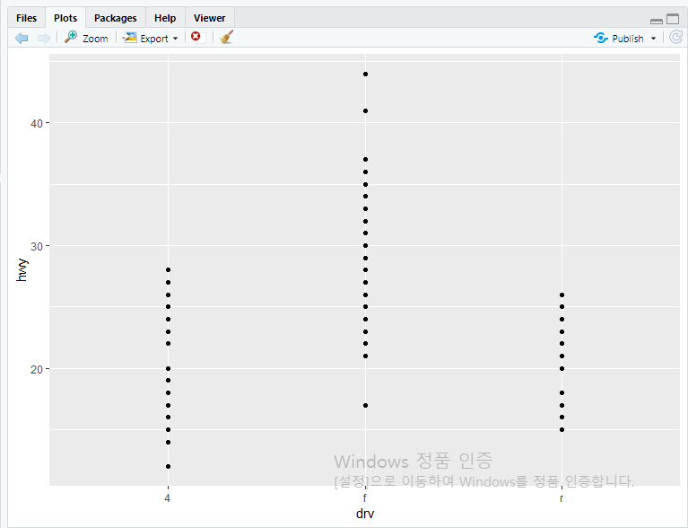
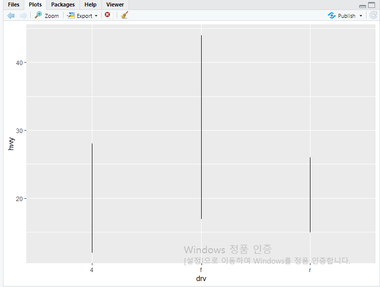

3일차 Azure Network 이해 하기 위한 Network 기초
==

1. IP address
2. subnetting, CIDR 표기법
3. OSI 7Layer
4. Network 장비(라우터, 스위치, 허브)
5. NAT
6. VPN
7. DNS

4일차 
module 5
533 module 2

## 복습

### 리소스 그룹 만들기

### Windows Server 2016 만들기
temporary storage는 D드라이브의 용량임

Premium disk는 ssd

MAX IOPS가 Page임.

[azure 문서](http://azure.microsoft.com)

[microsoft 문서 사이트](docs.microsoft.com)

ACU(Azure 컴퓨팅 단위) > VM 유형 및 크기

size(크기) 관리 탭에서 확인.

### 디스크 설정

OS disk type: standard SSD 선택

### 네트워크

NIC network security group도 하나의 서비스임.

만들어져있는 네트워크에 머신을 연결하는 것임

여러 대의 VM을 만들 때는 네트워크(가상 네트워크)를 만들고 그 안에 머신을 추가할 수 있음

### 관리

부팅 진단 옵셔을 켜면 좀 느림.

자동 종료는 off 해야 함.

백업 할 때는 recovery vault service가 실행되는 것임

> 실무에서는 리소스 그룹이름을 만들 때 인사부, 관리부 이런식으로 만듦

현재 멀티캠퍼스에서는 공인 아이피로 접속이 안돼서

## 1. IP Address v4 (32bit=2^32=42억9천개) v6(128bit=340언데실리온), 인터넷의 주소 체계

``A Class`` 0(;첫 비트가 0인 것) =>   00000000 00000000 00000000 00000000(첫 IP, 0.0.0.0)

                        01111111 11111111 11111111 11111111(마지막 IP, 127.255.255.255)

                        N.H.H.H 255.0.0.0

                        Network 수(2^7 - 2 = 126), Host 수 (2^24 - 2; 호스트 수는 항상 2개를 빼줌)

> 127로 시작되는 것은 특수한 IP라고 해서, Loop-back 이라고 함. 자기IP로 나감
> 0번도 특수하게 쓰임. 네트워크 식별

                        하나의 8비트를 옥텟이라고 함.

``B class`` 10 => 10000000 00000000 00000000 00000000 (128.0.0.0)

                  10111111 11111111 11111111 11111111 (191.255.255.255)

                  N.N.H.H 255.255.0.0

                  Network 수(2^14 = 16384), Host 수(2^16 - 2 = 65534)

                  

``C Class`` 110 => 192.0.0.0

                   223.255.255.255

                   N.N.N.H

                   Network 수 (2^21 = 2097152), Host 수 (2^8 - 2 = 254)

IP를 목적지로 찾기 위한 주소체계는 A~C까지만 쓰임.

``D Class`` 1110
멀티캐스팅 용도(1: 그룹통신), (Q. 1:그룹 통신이라는 것은 어떤 의미임?)

``E Class`` 1110

군사 용도 또는 예약 IP

        11111111

1bit 2^1=2
    0
    1
2bit 2^2=4
    00
    01
    10
    11

> ping을 한 번 넣으면 dns가 저장되어 있어서,
> ipconfig /flushdns 를 하면 dns 확인자 캐시를 삭제함

``C:\Windows\System32\drivers\etc\hosts`` 

이 파일이 메모리로 로드가 되게 되어 있음.

127.0.0.1(루프백 주소) 랜카드까지 갔다가 다시 돌아옴.(Q. loop-back 주소는 오직 127.0.0.1? A. 루프백 주소는 127.0.0.1이 아니라 아무 주소를 다 넣어도 동작함. 마지막 127.255.255.255는 동작 안함)

루프백 주소가 있는 이유는 개발자가 서버를 세팅해서 하기 어렵고, 자신의 컴퓨터에서 테스트 해보려고 있는 것임.

데이터 전송 방식이 세 가지가 있음.

- 유니캐스트(1:1 통신하는 방식): 대부분 이 방식으로 동작함, A, B, C 클래스의 IP
- 멀티캐스트(1:N 통신하는 방식): 하나의 데이터를 보내면서 여러명에게 동시에 전송할 수 있음. (D클래스 IP를 사용함)
- 브로드캐스트(1:모든(라우터에서 필터)): 브로드캐스트 IP를 씀. 라우터에서 필터링 되어 있음. 따라서 라우터 밖으로 나가지는 못하고 네트워크 내부에서 브로드캐스팅 됨.

IP Address = Network ID(네트워크를 식별; 우편번호; ISP에서 부여) + Host ID(네트워크 내의 시스템을 식별; 번지; 네트워크 관리자가 부여)

LAN을 네트워크라고 함.

라우터가 네트워크를 분리시켜주는 장비.

Network ID는 네트워크 자체를 말함

HOST ID의 모든 비트가 0일때: Network를 식별
Host ID의 모든 비트가 1일 때: BroadCast 데이터 전송시 사용

패킷의 source ip에 A~C클래스가 들어가면 유니캐스트, ip에 D클래스가 들어가면 멀티캐스트

IP를 관리하는 단체가 IANA임

``ISP``(Internet Service Provider)

ISP에서 IANA에 돈을 주고 IP를 구매함.

Network ID는 IANA > ISP > 회사 이런식으로 네트워크 ID를 부여 받음

Gateway IP: 라우터 장비에 부여 되는 IP, 내부네트워크와 외부 네트워크의 관문

이 경우에는 Network Address는 70.12.113.0

자신의 IP와 Subnet Mask를 AND 연산하여 자신의 Network ID를 식별하고

목적지 IP와 자신의 Subnet Mask를 AND 연산하여 목적지 Network ID를 식별

두 Network가 동일할 경우 Gateway 없이 통신하고 다를 경우 패킷을 Gateway에 전송

subnet mask가 없으면 네트워크 ID를 찾을 수가 없음

``첫 번째 비트부터 1이 들어가는 비트``까지 ``Network ID``

예전엔 이렇게 썼는데 요즘에는 IP낭비가 너무 심한 듯 하여 subnetting을 좀 다르게함.

CIDR(classless Inter-Domain Routing): Subnet Mask를 10진법으로 표기 하지 않고 2진법으로 표기

Class는 IP 낭비가 심함. 10진법 표기

우리 회사는 50개의 IP가 필요합니다. Subnet Mask?

ip/26 <=== Subnet Mask 1 비트수 (2진수에서 1이 들어간 비트 수)

ip/255.255.255.192  11111111 11111111 11111111 11000000

(아래의 문제에서 한문제 나옴. subnet mask가 어디까지 들어가면 좋겠느냐.)

우리회사는 300개의 IP가 필요합니다. 최적의 Subnet Mask? 23, 255.255.254.0

우리회사는 2000개의 IP가 필요합니다. 최적의 subnet mask? 21, 255.255.248.0

### Sub Network

ISP에서 70.12.113.0/24 를 부여받았다. 2개의 네트워크를 분할 해서 사용 하려고 한다.

서브 네트워크를 만드는 것을subnetting이라고 함.

라우터에 포트가 여러개가 있는데 router에 부여되는 ip가 gateway ip임.

router에 포트가 있고. 스위치나 허브가 물림.

router에 서브넷 마스크가 할당 됨.

70.12.113.00000000 70.12.113.0/25

- Network ID: 70.12.113.0
- Broadcast IP: 70.12.113.127
- Host 수: 126대
- IP 범위: 1~126

70.12.113.10000000 70.12.113.128/25

- Network ID: 70.12.113.128
- Broadcast IP: 70.12.113.255
- Host 수: 126대
- IP 범위: 129~254

