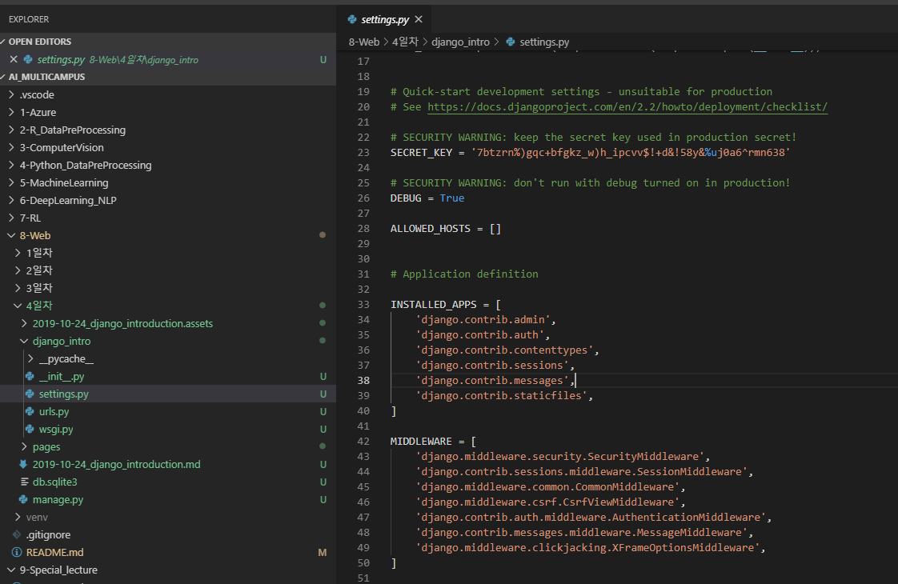
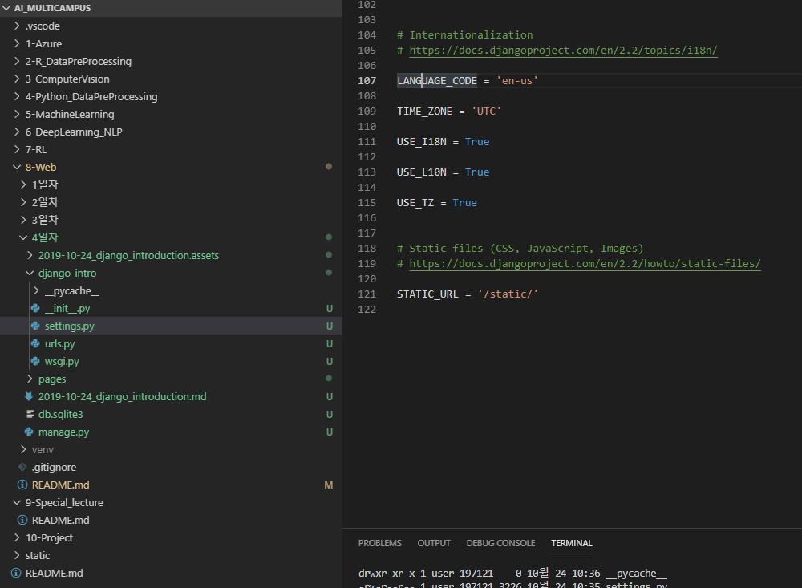

# django

## history of django

django의 탄생

2005년 7월

2008년 v1.0

2017 v2.0

## django의 인기

https://hotframeworks.com


## 카페를 창업하는 두 가지 방법

- A-Z 전부 스스로 하는 방법
- 프렌차이즈 카페를 여는 방법


## 웹 서비스를 제작하는 두 가지 방법

- A-Z 전부 스스로 하는 방법
- 프레임워크를 사용해서 웹 서비스를 제작하는 방법


instagram, nasa, moz://a, youtube가 django를 사용했음


장고는 내부적으로 MVC를 사용하는데 장고는 MTV(model, template, view)로 구성되어 있습니다.

M: 데이터를 관리

T: 사용자가 보는 화면

V: 중간 관리자


## 데코레이터(학생들의 추가적인 이해를 돕기 위해)

```python
def hello(func):
    def wrapper():
        print('hihi')
        func()
        print('hihi')
    return wrapper

@hello
def bye():
    print("byebye")

bye()
```


## 가상환경 만들기

- git bash와 visual studio code가 설치되어 있다고 가정합니다.

visual studio code 내에서 

현재 폴더에서 가상환경에 관한 폴더를 만듭니다. 저는 8-web이라는 폴더 이하로 두겠습니다.

```bash
$ pwd
/c/Users/user/Documents/AI_multicampus/8-Web
$ python -m venv venv
```

이후

```bash
$ vi ~/.bashrc
```

```bash
export PATH="/c/Python/Python37:/c/Python/Python37/Scripts:$PATH"
alias python="winpty python"
alias activate="source venv/Scripts/activate"
```

위의 내용을 .bashrc에 기록합니다.

이후로 8-web에서 `activate`를 실행하면 됩니다.

```bash
# django 프로젝트 만들기
$ django-admin startproject django_intro .

# 서버 실행
$ python manage.py runserver
```


크롬을 켜고 localhost:8000으로 들어가면, django 페이지가 마중을 나와줍니다 !!

```bash
$ python manage.py startapp pages # pages는 앱 이름입니다.
```

model.py

django_admin에는 project에 관한 파일들이 있고, 앱을 만들면 앱에 관한 페이지가 나타납니다.


settings.py 파일에 여기에 INSTALLED_APPS에 'pages'를 한줄 추가해줘야 합니다.





LANGUAGE_COD도 en-us에서 ko-kr로 바꿔줍니다.


## index페이지 작성(view 부분)

django_intro/pages/views.py를 다음과 같이 수정해줍니다.

```python
from django.shortcuts import render

# Create your views here.
def index(request):
    return render(request, 'index.html')
```


## urls 부분

django_intro/urls.py

```python
"""django_intro URL Configuration

The `urlpatterns` list routes URLs to views. For more information please see:
    https://docs.djangoproject.com/en/2.2/topics/http/urls/
Examples:
Function views
    1. Add an import:  from my_app import views
    2. Add a URL to urlpatterns:  path('', views.home, name='home')
Class-based views
    1. Add an import:  from other_app.views import Home
    2. Add a URL to urlpatterns:  path('', Home.as_view(), name='home')
Including another URLconf
    1. Import the include() function: from django.urls import include, path
    2. Add a URL to urlpatterns:  path('blog/', include('blog.urls'))
"""
from django.contrib import admin
from django.urls import path
from pages import views # pages앱의 views를 사용하기 위해서 불러오기

urlpatterns = [
    path('admin/', admin.site.urls),
    path('index/', views.index), # 경로 끝에 /를 붙이는 습관 만들기
]
```

```python
from django.shortcuts import render

# Create your views here.
def index(request):
    return render(request, 'pages/index.html')
```

위와 같이 적을 수 있는데, 장고가 자동으로 templates를 잡기 때문에 pages부터만 적으면 됩니다.


## 템플릿 만들기

pages/templates/pages/index.html

```html
<!DOCTYPE html>
<html lang="en">
<head>
    <meta charset="UTF-8">
    <meta name="viewport" content="width=device-width, initial-scale=1.0">
    <meta http-equiv="X-UA-Compatible" content="ie=edge">
    <title>Document</title>
</head>
<body>
    <h2>Hi django</h2>
</body>
</html>
```


```bash
$ python manage.py runserver
```

위의 명령어를 실행한 후, index로 접속하면 다음과 같은 창이 뜨게 됩니다.


## 실행 결과(localhost:8000/index)


## 실습

자기소개 페이지를 `/introduce`라는 경로에 만들기

---

