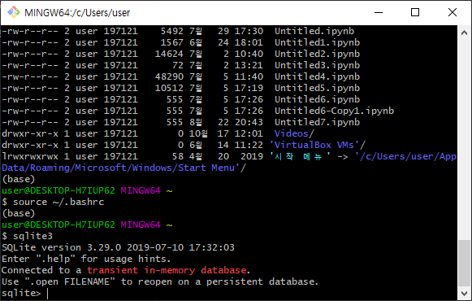

# ORM


## sqlite3

sqlite 다운로드 받기


파일을 두개 다 받아서 하나의 폴더에다 넣습니다.


git bash에서 바로 실행하기 위해서 환경변수에도 설정해줍니다.


여기까지 하면, command 창에서는 실행이 되지만 git bash에서 실행이 되지 않습니다. 따라서, `~/.bashrc` 파일을 수정해야 합니다.


```bash
(venv) $ source ~/.bashrc
```

위의 명령어를 입력한 후, 이제 sqlite3가 git bash에서 실행이 됩니다.



```bash
(venv) $ django-admin startproject crud .
```

settings.py에서 해당 앱(articles)를 추가해주고, 시간 값, 언어를 설정해줍니다.

이후 models.py를 수정해줍니다.


`Article`이라는 클래스를 만드는데 이 클래스는 `models.Model`을 항상 상속 받습니다.


위와 같이

```python
# models.py

from django.db import models

class Article(models.Model):
    # id값은 장고가 알아서 만들어 줍니다.
    title = models.CharField(max_length=50)
    content = models.TextField()
    created_at = models.DateTimeField(auto_now_add=True)
    updated_at = models.DateTimeField(auto_now=True)
```

```bash
$ python manage.py makemigrations
```


명령을 실행시키면, articles/migrations 폴더에 다음과 같은 파일이 만들어집니다. 이게 설계도 같은거에요


migrations는 설계도일뿐 아직 데이터베이스에 실제로 반영되지는 않은거에요

```bash
$ python manage.py migrate
```

위의 명령어를 입력해주면 실제로 반영이 됩니다.


제대로 반영이 잘 되었는지 sqlite로 확인할 수 있습니다.

```bash
# django_orm 폴더에서
$ sqlite3 db.sqlite3
```


- 간단한 sqlite 명령어

```sqlite
.table
.exit
```


## sql문이 실제로 어떻게 적용되었는지 확인하는 명령어

sql문만 보여줄 뿐, 적용이 되는 것은 아닙니다.

```bash
$ python manage.py sqlmigrate articles 0001
# python manage.py sqlmigrate <앱 이름> <migration 번호만>
```


## migration이 적용되었는지 확인하는 명령어

```bash
$ python manage.py showmigrations
```


[x] 표시가 된 것은 makemigrations를 통해서 마이그레이션이 만들어졌고, migrate를 통해서 적용이 된 것이고

[x] 표시가 되지 않은 것은 makemigrations를 통해서 마이그레이션은 만들어졌지만, migrate가 되지 않은 것입니다.

```
1. models.py: 모델 작성 및 변경
2. makemigrations: migration 파일 생성 (설계도)
3. migrate: 실제 DB에 적용(테이블 생성)
```


## shell로 들어가기

```bash
$ python manage.py shell
```


## record를 만드는 첫 번째 방법(각각 만들어서 save)

```python
# Article 클래스를 불러옵니다.
>>> from articles.models import Article

# select * from <table>에 해당하는 명령어 입니다.
>>> Article.objects.all()
<QuerySet []>
>>> article1 = Article()
>>> article1
<Article: Article object (None)>
>>> article1.title = '1번제목'
>>> article1.title
'1번제목'
>>> article1.content = '1번내용'
>>> article1.content
'1번내용'
>>> article1.save()
>>> article1.created_at
datetime.datetime(2019, 10, 29, 1, 46, 35, 161295, tzinfo=<UTC>)
```


## record를 만드는 두 번째 방법(클래스에 값을 넣어서 초기화 한 후 save)

```python
>>> article2 = Article(title='2번제목', content='2번내용')
>>> article2.title
'2번제목'
>>> article2.save()
>>>
```


## record를 만드는 세 번재 방법

```python
>>> Article.objects.create(title='3번제목', content='3번 내용')
<Article: Article object (3)>
```

위의 방법은 save까지 한꺼번에 됩니다.

## validation check

```python
>>> article4 = Article()
>>> article4.title = '4번제목'
>>> article4.full_clean()
Traceback (most recent call last):
  File "<console>", line 1, in <module>
  File "C:\Users\user\Desktop\django_orm\venv\lib\site-packages\django\db\models\base.py", line 1203, in full_clean
    raise ValidationError(errors)
django.core.exceptions.ValidationError: {'content': ['이 필드는 빈 칸으로 둘 수 없습니다.']}
>>> article4.save()
>>> article4
<Article: Article object (4)>
>>> Article.objects.all()
<QuerySet [<Article: Article object (1)>, <Article: Article object (2)>, <Article: Article object (3)>, <Article: Article object (4)>]>
>>>
```

필수 항목인 Article.content를 입력하지 않았기 때문에, `article4.full_clean()`으로 유효성 검사를 하면

에러가 나옵니다. 따라서, 수동으로 수정을 해줘야 합니다. (자동으로 수정되지 않음)

그리고 유효성 검사를 통과하지 못하더라도 article의 저장은 됩니다.


## class의 출력 형식 변경

```python
# articles/models.py
from django.db import models

# Create your models here.
class Article(models.Model):
    # id값은 장고가 알아서 만들어 줍니다.
    title = models.CharField(max_length=50)
    content = models.TextField()
    created_at = models.DateTimeField(auto_now_add=True)
    updated_at = models.DateTimeField(auto_now=True)

    def __str__(self):
        return f'{self.id}번글- {self.title}: {self.content}'
```

models.py의 내용은 변경이 되었지만, 모델이 변경되지 않았기 때문에 마이그레이션은 해주지 않아도 됩니다.


shell을 종료해 주시고, 다시 shell을 실행합니다.

```bash
$ python manage.py shell
```


```python
>>> from articles.models import Article
>>> Article.objects.all()
<QuerySet [<Article: 1번글- 1번제목: 1번내용>, <Article: 2번글- 2번제목: 2번내용>, <Article: 3번글- 3번제목: 3번 내용>, <Article: 4번글- 4번제목: >]>
```

실행해보면, 출력 형식이 달라진 것을 확인할 수 있습니다.


## 데이터 가져오기

### get - 하나의 레코드를 가져올 때

```python
>>> article3 = Article.objects.get(pk=3)
# >>> article3 = Article.objects.get(id=3)
# id와 pk는 같습니다.
```


### filter - 필터 적용

```python
# filter 적용하기
>>> article = Article.objects.filter(title='3번제목')
>>> article
<QuerySet [<Article: 3번글- 3번제목: 3번 내용>]>
```


### last - 마지막 항목 가져오기

```python
>>> article = Article.objects.all().last()
>>> article
<Article: 4번글- 4번제목 : >
```


### order_by - 쿼리 결과를 정렬해서 반환

```python
# 오름차순 정렬
>>> articles = Article.objects.all().order_by('pk')
>>> articles
<QuerySet [<Article: 1번글- 1번제목: 1번내용>, <Article: 2번글- 2번제목: 2번내용>, <Article: 3번글- 3번제목: 3번 내용>, <Article: 4번글- 4번제목: >]>
```

```python
# 내림차순 정렬
>>> articles = Article.objects.all().order_by('-pk')
>>> articles
<QuerySet [<Article: 4번글- 4번제목: >, <Article: 3번글- 3번제목: 3번 내용>, <Article: 2번글- 2번제목: 2번내용>, <Article: 1번글- 1번제목: 1번내용>]>
```


### indexing, slicing

```python
# 슬라이싱
>>> articles[:2]
<QuerySet [<Article: 4번글- 4번제목: >, <Article: 3번글- 3번제목: 3번 내용>]>

# 인덱싱
>>> articles[0]
<Article: 4번글- 4번제목: >
```


## 특정 데이터를 포함하는 레코드 찾기

```python
# SQL의 'like' 표현
>>> Article.objects.filter(title__contains='1번')
<QuerySet [<Article: 1번글- 1번제목: 1번내용>]>

# 특정 데이터로 시작하는 것 찾기
>>> Article.objects.filter(title__startswith='1')
<QuerySet [<Article: 1번글- 1번제목: 1번내용>]>

# 특정 데이터로 끝나는 것 찾기
>>> Article.objects.filter(title__endswith='목')
<QuerySet [<Article: 1번글- 1번제목: 1번내용>, <Article: 2번글- 2번제목: 2번내용>, <Article: 3번글- 3번제목: 3번 내용>, <Article: 4번글- 4번제목: >]>
```


## update

단순히 레코드를 가져와서 정보를 바꾸고 save()해주면 정보가 업데이트 됩니다.

```python
>>> article = Article.objects.get(pk=1)
>>> article.title
'1번제목'
>>> article.title = '2번제목'
>>> article.title
'2번제목'
>>> article.save()
```

